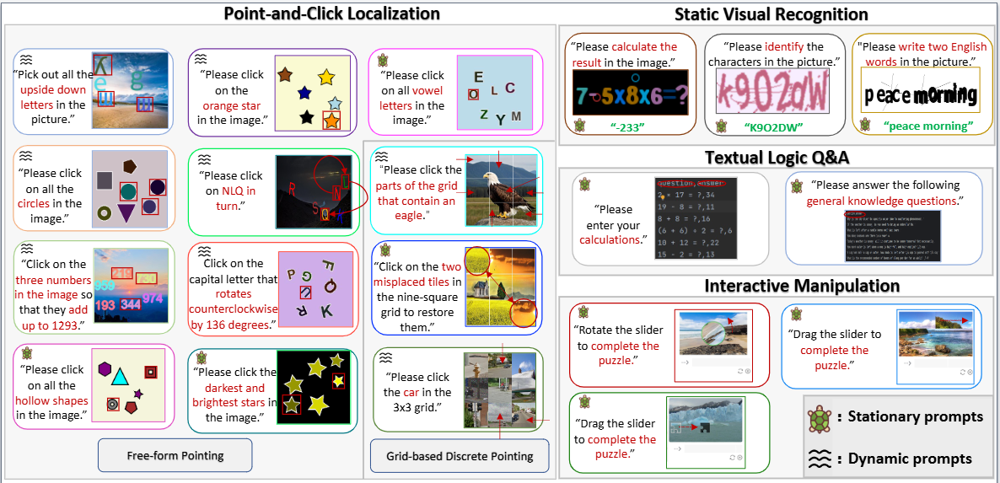
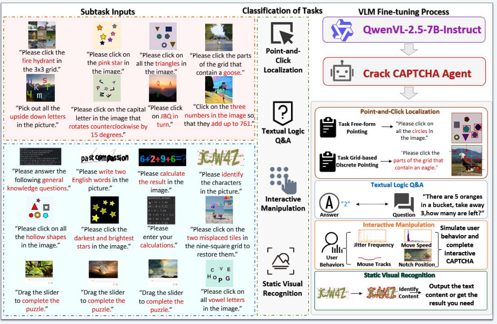

# :fire: MCA-Bench: A Multimodal Benchmark for Evaluating CAPTCHA Robustness Against VLM-based Attacks (AAAI2026 oral)


<div align="center">
<strong>Zonglin Wu¹</strong>  <strong>Yule Xue¹</strong>  <strong> Yaoyao Feng¹</strong>  <strong> Xiaolong Wang¹</strong>  <strong>Yiren Song²</strong><sup>★</sup><br>  
<strong>¹</strong> Southwest University  <strong>²</strong> National University of Singapore<br>
<sub>★ Correspondence to: <a href="mailto:songyiren725@gmail.com">songyiren725@gmail.com</a></sub>
</div>


# Introduction

As automated attack techniques rapidly advance, CAPTCHAs remain a critical defense mechanism against malicious bots. However, existing CAPTCHA schemes encompass a diverse range of modalities -- from static distorted text and obfuscated images to interactive clicks, sliding puzzles, and logic-based questions -- yet the community still lacks a unified, large-scale, multimodal benchmark to rigorously evaluate their security robustness. To address this gap, we introduce MCA-Bench, a comprehensive and reproducible benchmarking suite that integrates heterogeneous CAPTCHA types into a single evaluation protocol. Leveraging a shared vision-language model backbone, we fine-tune specialized cracking agents for each CAPTCHA category, enabling consistent, cross-modal assessments. Extensive experiments reveal that MCA-Bench effectively maps the vulnerability spectrum of modern CAPTCHA designs under varied attack settings, and crucially offers the first quantitative analysis of how challenge complexity, interaction depth, and model solvability interrelate. Based on these findings, we propose three actionable design principles and identify key open challenges, laying the groundwork for systematic CAPTCHA hardening, fair benchmarking, and broader community collaboration. Datasets and code are available online.

Datasets are available at https://www.kaggle.com/datasets/luffy798/mca-benchmultimodal-captchas. 

Paper:https://arxiv.org/abs/2506.05982



# Method



# Performance

- **MCA-Bench**: the first large-scale, cross-modal CAPTCHA attack benchmark with 20 real tasks.  
- **Proposed** a unified evaluation pipeline with a single pass-rate metric and open source scripts.  
- **First** full-scale CAPTCHA security assessment with guidance for human–machine verification.  

---

### 📊 Comparison of pass rates for various CAPTCHA types

| CAPTCHA Category                 | Task Name                    | QwenVL-2.5-7B-Instruct Pass Rate | Human Pass Rate |
| -------------------------------- | ---------------------------- | -------------------------------- | --------------- |
| **Point-and-Click Localization** | 3×3 grid selection           | 0.96                             | 0.88            |
|                                  | Inverted-letter selection    | 0.52                             | 0.94            |
|                                  | Geometric-shape recognition  | 0.96                             | 0.98            |
|                                  | Brightness discrimination    | 0.665                            | 0.78            |
|                                  | Hollow-pattern recognition   | 0.995                            | 0.98            |
|                                  | Sequential-letter ordering   | 0.925                            | 0.98            |
|                                  | Full-image grid selection    | 0.35                             | 0.74            |
|                                  | Color discrimination         | 0.99                             | 0.88            |
|                                  | Vowel selection              | 0.975                            | 0.80            |
|                                  | Arithmetic selection         | 0.025                            | 0.78            |
|                                  | Rotated-letter selection     | 0.335                            | 0.74            |
|                                  | 3×3 jigsaw-swap selection    | 0.96                             | 0.80            |
| **Static Visual Recognition**    | Classic character CAPTCHA    | 0.32                             | 0.92            |
|                                  | Distorted-word CAPTCHA       | 0.985                            | 0.84            |
|                                  | Arithmetic-character CAPTCHA | 0.695                            | 0.98            |
| **Textual Logic Q&A**            | Text-based arithmetic        | 0.985                            | 0.97            |
|                                  | Commonsense reasoning        | 0.97                             | 0.86            |
| **Interactive Manipulation**     | Sliding-block                | 0.36                             | 0.74            |
|                                  | Rotation-block               | 0.28                             | 0.76            |
|                                  | Alignment sliders            | 0.55                             | 0.72            |

# Quickstart

### Environment

We use the same environment as Qwen 2.5-vl, refer to https://github.com/QwenLM/Qwen2.5-VL.

### Project guidance

**train:** This contains four large categories and 20 small categories of CAPTCHA training files that can be used to fine-tune with the model.

**test**:Evaluation documents for the model.

**tojson**: Data preprocessing files.

## Citation

If you find our paper and code useful in your research, please consider giving a star ⭐ and citation 📝 :)

```latex
@article{Wu_Xue_Feng_Wang_Song_2026, title={MCA-Bench: A Multimodal Benchmark for Evaluating CAPTCHA Robustness Against VLM-based Attacks}, volume={40}, url={https://ojs.aaai.org/index.php/AAAI/article/view/41141}, DOI={10.1609/aaai.v40i44.41141}, abstractNote={As automated attack techniques rapidly advance, CAPTCHAs remain a critical defense mechanism against malicious bots. However, existing CAPTCHA
schemes encompass a diverse range of modalities—from static distorted text and
obfuscated images to interactive clicks, sliding puzzles, and logic-based questions—yet the community still lacks a unified, large-scale, multimodal benchmark to rigorously evaluate their security robustness. To address this gap, we
introduce MCA-Bench, a comprehensive and reproducible benchmarking suite
that integrates heterogeneous CAPTCHA types into a single evaluation protocol.
Leveraging a shared vision–language model backbone, we fine-tune specialized
cracking agents for each CAPTCHA category, enabling consistent, cross-modal
assessments. Extensive experiments reveal that MCA-Bench effectively maps
the vulnerability spectrum of modern CAPTCHA designs under varied attack
settings, and—crucially—offers the first quantitative analysis of how challenge
complexity, interaction depth, and model solvability interrelate. Based on these
findings, we propose three actionable design principles and identify key open
challenges, laying the groundwork for systematic CAPTCHA hardening, fair
benchmarking, and broader community collaboration.}, number={44}, journal={Proceedings of the AAAI Conference on Artificial Intelligence}, author={Wu, Zonglin and Xue, Yule and Feng, Yaoyao and Wang, Xiaolong and Song, Yiren}, year={2026}, month={Mar.}, pages={38039-38047} }
```

